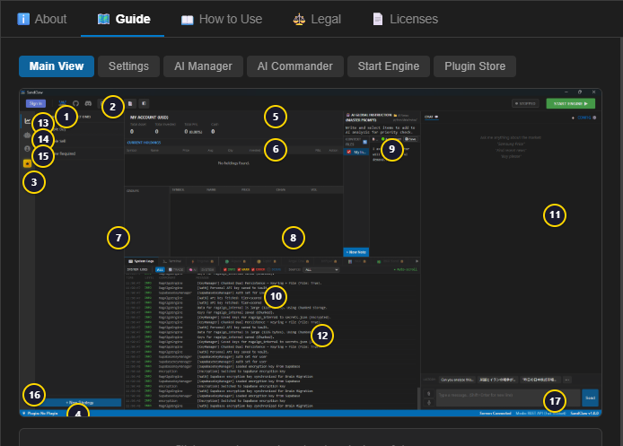
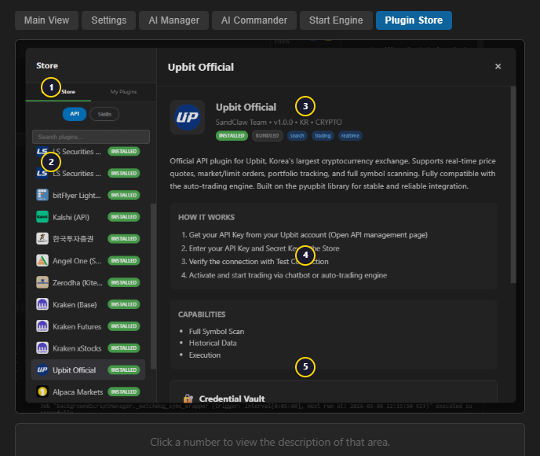
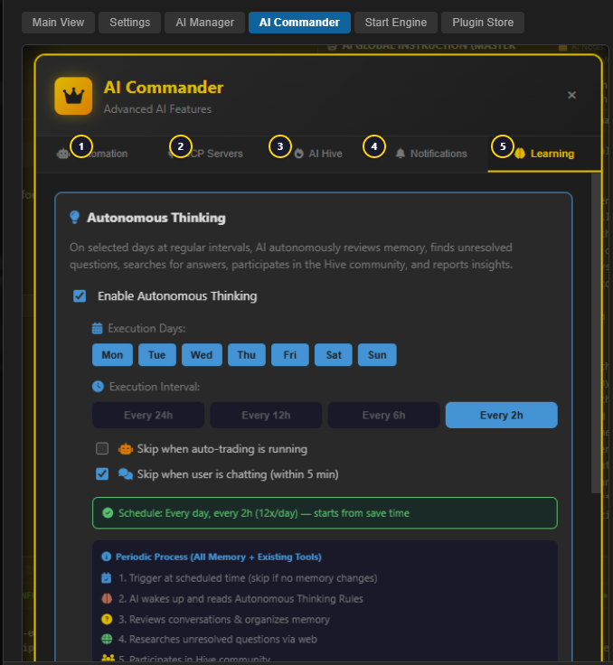

<p align="center">
  
</p>

<h3 align="center">Raise your own AI trader from scratch.</h3>

<p align="center">
  <strong>AI-Powered Trading Desktop IDE</strong><br>
  No preloaded signals. No black-box strategies. Start from zero — your AI learns from you.
</p>

<p align="center">
  <a href="https://github.com/kokogo100/sandclaw-releases/releases/latest"></a>
  <a href="#plugins-30"></a>
  <a href="#coverage"></a>
  <a href="#security"></a>
  <a href="https://github.com/kokogo100/sandclaw/issues"></a>
</p>

---

<p align="center">
  <a href="https://github.com/kokogo100/sandclaw-releases/releases/download/v0.9.1/SandClaw_0.9.1_x64-setup.exe">
    
  </a>
</p>

---

<p align="center">
  
</p>

## Why SandClaw?

- **AI starts from zero** — No preloaded opinions or signals. The AI learns from your conversations and builds memory over time.
- **30+ broker plugins** — Connect to IBKR, Kraken, Upbit, LS Securities, Alpaca, and more. Install from the built-in Plugin Store.
- **Your funds never leave your broker** — SandClaw connects directly to broker APIs. We never hold or access your money.
- **Free to use** — No deposits, no withdrawals, no fees.
- **Desktop IDE + 24/7 bot** — Develop strategies in the IDE, then deploy as a headless bot that runs around the clock.

## How It Works

```
1. Install SandClaw           →  Download EXE, run installer, login with GitHub
2. Connect your broker        →  Install a plugin from the Store, enter API keys
3. Chat with your AI trader   →  The AI learns your style and executes trades
```

<p align="center">
  
</p>

## Plugins (30)

<a id="coverage"></a>

| | Count |
|---|---|
| **Total Plugins** | **30** |
| API Trading Plugins | 22 |
| Limit Order Support | 22 |
| Regions | KR, US, JP, IN, Global |
| Asset Classes | Stocks, Crypto, Futures, Options, Forex, Bonds, Prediction Markets |

### Bundled (included with IDE)

| Plugin | Region | Asset Class | Features |
|--------|--------|-------------|----------|
| **Web Search** | — | — | DuckDuckGo market monitoring, no API key |

### Store — Base Plugins (18)

| Plugin | Region | Asset Class | Auth | Features |
|--------|--------|-------------|------|----------|
| **Upbit** | KR | Crypto | API Key | 200+ KRW pairs, Limit Order |
| **Alpaca** | US | Stock, Crypto | API Key | Paper Trading, Fractional Shares, Limit Order |
| **LS Securities** | KR | Stock (KRX) | OAuth | 13 markets, WebSocket, Limit Order |
| **KIS Securities** | KR | Stock (KRX) | API Key | WebSocket, Limit Order |
| **Kraken** | Global | Crypto | HMAC-SHA512 | 300+ pairs, WebSocket, Limit Order |
| **Interactive Brokers** | Global | Multi-Asset | CDP Cookie | 150+ markets, 33 countries, Limit Order |
| **Kalshi API** | US | Prediction Market | RSA-PSS | 38 tools, all orders are limit |
| **Angel One** | IN | Stock (NSE/BSE) | API Key | WebSocket, Limit Order |
| **Zerodha** | IN | Stock (NSE/BSE) | API Key | WebSocket, Limit Order |
| **Upstox** | IN | Stock (NSE/BSE) | OAuth | WebSocket, Limit Order |
| **bitFlyer** | JP | Crypto | HMAC-SHA256 | WebSocket, Limit Order |
| **kabu STATION** | JP | Stock (TSE) | API Key | WebSocket, Limit Order (VIEW ONLY) |
| **Kalshi** (Browser) | US | Prediction Market | Browser Login | CDP browser automation |
| **Robinhood** (Browser) | US | Stock, Crypto, Events | Browser Login | CDP browser automation |
| **Web Browsing CDP** | — | — | None | General browser automation skill |
| **SBI Securities** | JP | Stock (TSE) | Browser | CDP automation |
| **Rakuten Securities** | JP | Stock (TSE) | Browser | CDP automation |
| **Kraken Equities** | US | Stock, ETF | — | VIEW ONLY (API not yet available) |

### Store — Extension Plugins (11)

Extensions require their base plugin to be installed.

| Extension | Base | Asset Class | Features |
|-----------|------|-------------|----------|
| **LS Futures** | LS Securities | KOSPI200 Futures/Options | Limit Order |
| **LS Night** | LS Securities | Night Session Futures | Limit Order |
| **LS Overseas** | LS Securities | US Stocks (NYSE/NASDAQ) | Limit Order |
| **LS Overseas Futures** | LS Securities | Global Futures (CME, ICE...) | Limit Order |
| **Kraken Futures** | Kraken | Crypto Perpetuals | Up to 50x leverage, Limit Order |
| **Kraken xStocks** | Kraken | Tokenized US Equities | Fractional shares, 24/5, Limit Order |
| **IBKR Options** | Interactive Brokers | Options | Greeks, Limit Order |
| **IBKR Futures** | Interactive Brokers | Futures | Global markets, Limit Order |
| **IBKR Forex** | Interactive Brokers | Forex | Currency pairs, Limit Order |
| **IBKR Bonds** | Interactive Brokers | Fixed Income | Bond trading, Limit Order |
| **IBKR Events** | Interactive Brokers | Event Contracts | Prediction market, Limit Order |

> **Community Testing**: Some plugins (Angel One, Zerodha, Upstox, bitFlyer, kabu STATION, SBI, Rakuten) were implemented based on official API documentation but could not be tested with real accounts due to regional restrictions. If you encounter issues, please provide feedback via [GitHub Issues](https://github.com/kokogo100/sandclaw/issues).

## Autonomous AI Trading

<p align="center">
  
</p>

SandClaw's AI Commander runs autonomously, analyzing markets and executing your strategy 24/7. Start with paper trading, graduate to live when you're ready.

## Security

- All credentials encrypted via **Windows Credential Manager** (never stored in plain text)
- Plugin ZIPs verified with **SHA-256** checksums
- Registry signed with **Ed25519** (`registry/index.json.sig`)
- AST-based security scan on install (no `eval`, `exec`, `subprocess`, etc.)

## For Plugin Developers

1. Build your plugin following the [Plugin SDK docs](https://sandclaw.io/docs/plugins)
2. Package as ZIP: `manifest.json` + `main.py` + modules
3. Open a [GitHub Issue](https://github.com/kokogo100/sandclaw/issues) with your plugin
4. After review, your plugin appears in the Store for all users

---

<details>
<summary><strong>Windows SmartScreen Notice</strong></summary>

When you run the installer for the first time, Windows may show a blue or red SmartScreen warning.
This is normal for new applications without a paid code signing certificate (~$300/year).

1. Click **"More info"**
2. Click **"Run anyway"**

SandClaw is open source. You can verify the code at [GitHub](https://github.com/kokogo100/sandclaw).
</details>

<details>
<summary><strong>v0.9.0 Users — Manual Update Required</strong></summary>

v0.9.0 had a JWT key renewal issue. We released v0.9.1 to fix it, but auto-update does not work from v0.9.0.
Please manually download and install v0.9.1 by overwriting the existing installation.

**Do NOT fully uninstall SandClaw.** This will permanently delete your L4 Memory Keys. Always install by overwriting (run the installer without uninstalling first).
</details>

<details>
<summary><strong>Repository Structure</strong></summary>

```
registry/
  index.json          <- Master plugin list (fetched by SandClaw IDE)
  index.json.sig      <- Ed25519 signature
icons/                <- Plugin icons (PNG)
releases/             <- Plugin ZIP packages
```
</details>
